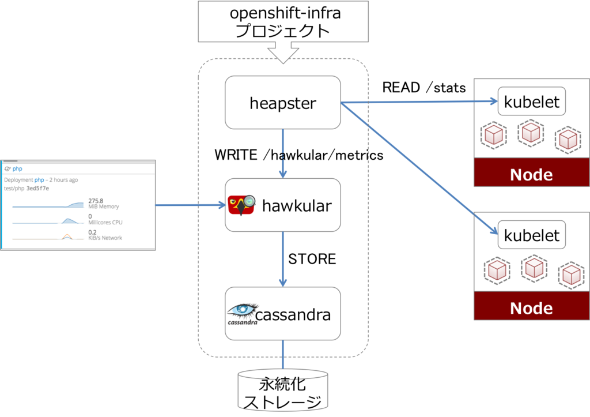
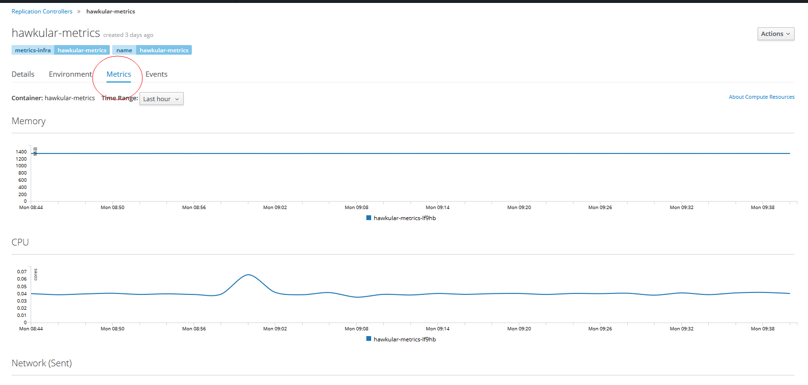

| 版本   |   日期   |   状态  | 修订人    |    摘要   |
| ------ | ----- | ----- | ------- | ------ |
| V1.0  | 2018-04-17  | 创建  |  开源方案   |    初始版本  |


## 度量采集服务架构图




## 使用ansible进行部署

- 安装openshift ansible 软件包
```
[root@hz01-online-ops-openmasteretc-01 /root]# yum install ansible.noarch java-1.8.0-openjdk-headless -y
[root@hz01-prod-ops-openshiftmaster-01 /opt] wget http://springdale.math.ias.edu/data/puias/unsupported/7/x86_64//python-passlib-1.6.2-2.sdl7.noarch.rpm
[root@hz01-prod-ops-openshiftmaster-01 /opt] rpm -ivh python-passlib-1.6.2-2.sdl7.noarch.rpm
```

- clone openshift-ansible 项目

```
[root@hz01-online-ops-openmasteretc-01 /root]# cd /opt
[root@hz01-online-ops-openmasteretc-01 /root]# git clone https://github.com/openshift/openshift-ansible.git
[root@hz01-online-ops-openmasteretc-01 /root]# git checkout origin/release-3.6
```

- 配置metric_hosts部署文件

```
[root@openshift-master ~]# cat /etc/ansible/metric_hosts
[OSEv3:children]
masters
nodes

[OSEv3:vars]
ansible_ssh_user=root
openshift_deployment_type=origin
openshift_metrics_install_metrics=True
openshift_metrics_image_prefix=openshift/origin-
#拉取的镜像版本
openshift_metrics_image_version=v3.6.1
openshift_metrics_resolution=10s
#metrics_hawkular服务对外的域名(指向router节点)
openshift_metrics_hawkular_hostname=metrics.ops.com
#master的ip
openshift_metrics_master_url=https://openshift.ops.com
# cassandra 使用临时存储
openshift_metrics_cassandra_storage_type=emptydir
[masters]
openshift-master

[nodes]
openshift-node1
openshift-node2
```

- 执行ansible-playbook(第一次执行可能会失败，如果失败就再执行一次)

```
ansible-playbook -i /etc/ansible/metric_hosts /opt/openshift-ansible/playbooks/byo/openshift-cluster/openshift-metrics.yml
```

- 执行结果，部署的快慢根据由拉取镜像的速度决定，成功的结果如下(READY都是1/1表示成功)
```
# oc get pod -n openshift-infra
NAME                         READY     STATUS    RESTARTS   AGE
hawkular-cassandra-1-m1p40   1/1       Running   0          4m
hawkular-metrics-lf9hb       1/1       Running   0          4m
heapster-1c2h0               1/1       Running   0          4m
```

- 检查master-config.yaml配置
```
cat /etc/origin/master/master-config.yaml
......
  masterPublicURL: https://openshift.ops.com:443
  metricsPublicURL: https://metrics.ops.com/hawkular/metrics   #确认此选项配置
  publicURL: https://openshift.ops.com:443/console/
....
```

- 重启master
```
systemctl restart origin-master
```

## 成功后查看监控信息



